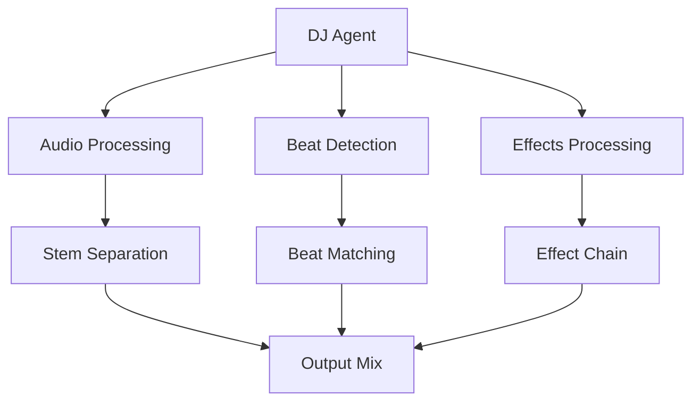
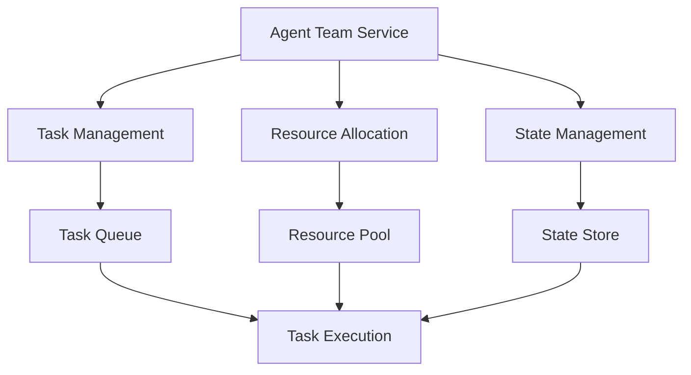
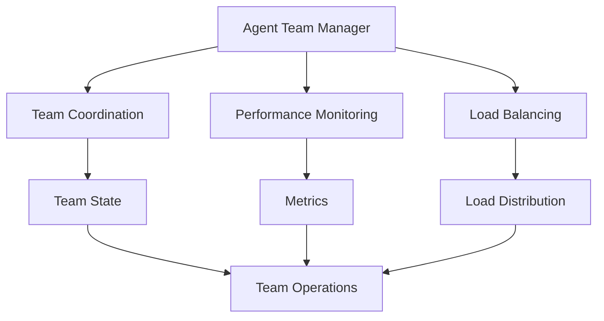
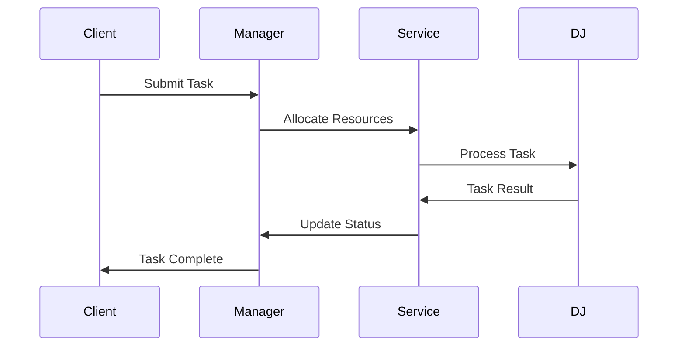
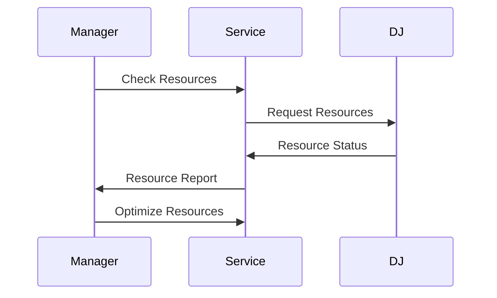
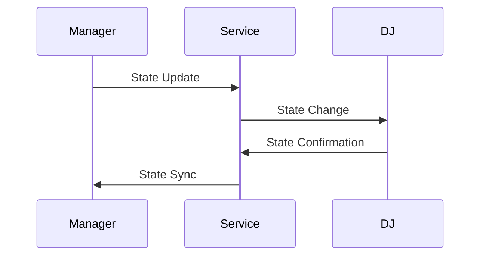

# LexOS Agent Architecture Documentation

## Overview

The LexOS system consists of three main agents working in concert:
1. DJ Agent (Dynamic Job)
2. Agent Team Service
3. Agent Team Manager

## Agent Interaction Patterns

### 1. DJ Agent (Dynamic Job)

#### Responsibilities
- Real-time audio processing
- Beat detection and matching
- Effects processing
- Stem separation
- Playlist management

#### API Endpoints
- `/api/dj/process` - Audio processing
- `/api/dj/effects` - Effects management
- `/api/dj/playlist` - Playlist operations
- `/api/dj/status` - Status monitoring

### 2. Agent Team Service

#### Responsibilities
- Task distribution
- Resource management
- State tracking
- Inter-agent communication
- Error handling

#### API Endpoints
- `/api/team/tasks` - Task management
- `/api/team/resources` - Resource allocation
- `/api/team/state` - State management
- `/api/team/health` - Health monitoring

### 3. Agent Team Manager

#### Responsibilities
- Team coordination
- Performance monitoring
- Load balancing
- Resource optimization
- Team state management

#### API Endpoints
- `/api/manager/coordinate` - Team coordination
- `/api/manager/monitor` - Performance monitoring
- `/api/manager/balance` - Load balancing
- `/api/manager/health` - Health monitoring

## Data Flow

### 1. Task Processing Flow

### 2. Resource Management Flow

### 3. State Management Flow

## Communication Protocols

### 1. WebSocket Communication
- Real-time updates
- State synchronization
- Event broadcasting
- Health monitoring

### 2. REST API
- Task management
- Resource allocation
- State management
- Configuration updates

### 3. Message Queue
- Task distribution
- Event handling
- Error reporting
- Log aggregation

## Error Handling

### 1. Error Types
- Task failures
- Resource exhaustion
- Communication errors
- State inconsistencies

### 2. Recovery Procedures
- Automatic retry
- State recovery
- Resource reallocation
- Team rebalancing

### 3. Error Reporting
- Error logging
- Alert generation
- Status updates
- Recovery tracking

## Monitoring and Metrics

### 1. System Metrics
- CPU usage
- Memory usage
- Network traffic
- Response times

### 2. Business Metrics
- Task completion rate
- Resource utilization
- Error rates
- Performance indicators

### 3. Health Checks
- Service health
- Resource health
- Communication health
- State health

## Security

### 1. Authentication
- API authentication
- WebSocket authentication
- Service authentication
- Resource authentication

### 2. Authorization
- Role-based access
- Resource permissions
- Task permissions
- State permissions

### 3. Data Protection
- Data encryption
- Secure communication
- Access control
- Audit logging

## Deployment

### 1. Service Deployment
- Container deployment
- Service discovery
- Load balancing
- Health monitoring

### 2. Resource Deployment
- Resource allocation
- Capacity planning
- Scaling strategy
- Backup procedures

### 3. State Management
- State persistence
- State recovery
- State synchronization
- State backup

## Maintenance

### 1. Regular Maintenance
- Health checks
- Performance optimization
- Resource cleanup
- State verification

### 2. Emergency Procedures
- Service recovery
- Resource recovery
- State recovery
- Team recovery

### 3. Update Procedures
- Service updates
- Resource updates
- State updates
- Team updates 